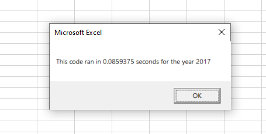
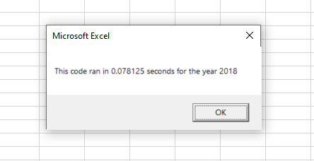

# Stock Analysis with VBA Excel

## Overview of Project

### Purpose
The purpose of this project was:
* To compare the stock performance between the year 2017 and 2018
* To refactor the VBA code by optimizing the steps, improving the logic and avoiding repetition
* To measure the performance of the refactored VBA code in terms of time taken to analyze the data. 

## Results

### Analysis

#### Performance of the stocks in 2017 and 2018
The stocks in the year 2017 and 2018 were compared based on the two factors listed below:

**1) Total Daily Volume**
  * The *Total Daily Volume* of the stock is calculated by adding the daily volume of that stock.
  * The "Volume" of the stock is added only if the ticker in the column "A" matched the ticker of interest 
  * The below logic is used to calculate the *Total Daily Volume*
  ```
         if (Cells(rowOfIntesert, "A").Value = ticker) Then
             totalDailyVolume = totalDailyVolume + DailyVolume
         End if
   ```
     
**2) Yearly return**
  * The *yearly return* of the stock is the percentage increase or decrease in the price from the beginning of the year to the end of the year.
  * This accounts to the increase or decrease in the closing price on the first day of the year to the closing price on the last day of the year.
  * The below logic is used to extract the information:
  ```
         yearlyReturn = endingPrice / startingPrice - 1
  ```

##### Performance of stocks in 2017
Most of the stocks in the year 2017 performed very well. 11 out of 12 has postive returns.

   
   
##### Performance of stocks in 2018
Most of the stocks in the year 2018 didn't perform very well. 10 out 12 have negative returns in 2018.

   

It is very easy to compare at a glance that the stocks in 2017 had better returns than in year 2018. Most of the stocks in 2017 have positive returns, while most of the stocks in 2018 have negative results.

However the ticker **RUN** shows very good returns in 2018 of 84%, which has increased from 5.5% in 2017.

#### Execution time of the original VBA code

The time taken to execute the analysis of the year 2017 using original code was around ~17 secs.

   

The time taken to execute the analysis of the year 2018 using original code was around ~17 secs.

   
   
The analysis took a long time to execute and produce the output due to the multiple times the **For** loop was executed to extract the Total Volume, starting and ending price.

The **For** loop was executed ``` (Total number of rows) times (total number of tickers) ```.

That is **3012 x 12 = 36,144** times.

Code :
```
    For i = 0 To 11
        ticker = tickers(i)
        totalVolume = 0
        
        '5) Loop through all rows in the data.
        
        For j = 2 To RowCount
            'Worksheets("2018").Activate
            Worksheets(yearValue).Activate
            
            '5a) Check if the ticker matches the value
            If (Cells(j, "A").Value = ticker) Then
                '5b) Find the total volume of the current ticker
                totalVolume = totalVolume + Cells(j, 8).Value
                
                '5c) Calculate the startPrice - Closing price of the first day
                If (Cells(j - 1, "A").Value <> ticker) Then
                    startPrice = Cells(j, "F")
                End If
                
                '5d) Calculate the endPrice - Closing proce of the last day
                If (Cells(j + 1, "A").Value <> ticker) Then
                    endPrice = Cells(j, "F")
                End If
            End If
        Next j
```
   
#### Execution time of the refactored VBA code

The time taken to execute the analysis of the year 2017 using refactored code around 0.08 secs.

   
   
The time taken to execute the analysis of the year 2018 using refactored code around 0.08 secs.

   

The code was refactored so that the **For** loop was executed only the ``` (Total number of rows) plus (Total number of ticker)```
That is **3012 + 12 = 3014** times. The execution time was directly proportional to the number of times the **For** loop executed.

Refactored VBA Code :

```
'2a) Initialize ticker volumes to zero
    For i = 0 To 11
        tickerVolumes(i) = 0
    Next i

    '2b) loop over all the rows
    For i = 2 To RowCount
    
        '3a) Increase volume for current ticker
        tickerVolumes(tickerIndex) = tickerVolumes(tickerIndex) + Cells(i, 8).Value
        
        '3b) Check if the current row is the first row with the selected tickerIndex.
        If (Cells(i - 1, "A").Value <> tickers(tickerIndex)) Then
            tickerStartingPrices(tickerIndex) = Cells(i, "F")
        End If
        
        '3c) check if the current row is the last row with the selected ticker
        If (Cells(i + 1, "A").Value <> tickers(tickerIndex)) Then
            tickerEndingPrices(tickerIndex) = Cells(i, "F")
            
            '3d Increase the tickerIndex.
            tickerIndex = tickerIndex + 1
        End If
    
    Next i
```

### Challenges
The only challenge I faced was that the data were getting written in random rows after 3012 and not at row 4 of **All Stocks Analysis** sheet.
The reason was that I was using the **For** loop with index ticker and was referring cells with index i. It had the value 3013 from the previous run.

The explanation given in the assignment and the steps in the code were very clear. I didn't face serious chanllenges.


## Summary
Refactoring the VBA code by optimizing logic and avoiding repitition has improved the efficiency and reduced the time taken to analyze the stock performance, from few seconds to fraction of a second. This has enabled the opportunity to expand the project to analyze much larger data in shorter amount of time.

### Advantages of refactoring code
*	Optimized code with clean solution
*	Higher efficiency with better execution time
*	Efficient of memory usage

### Disadvantages of refactoring code
*	It takes time and expertise to develop efficient refactored code.
*	It can be difficult to read (others) refactored code if there are no good explanation/comments.

### Comparison between original and refactoring code
* **Original code** is easy to develop, which can be *advantageous* in the beginning to develop idea/prototype.
* **Original code** can be less efficient, consume more memory and time, making it *disadvantageous* to analyze huge data.
* **Refactored VBA script** are very efficient and less time consuming to execute, making it *advantageous* to analyze large data in less time.
* **Refactored VBA script** needs lot of expertise and practice, which can be *disadvantageous* during the initial part of the project.

